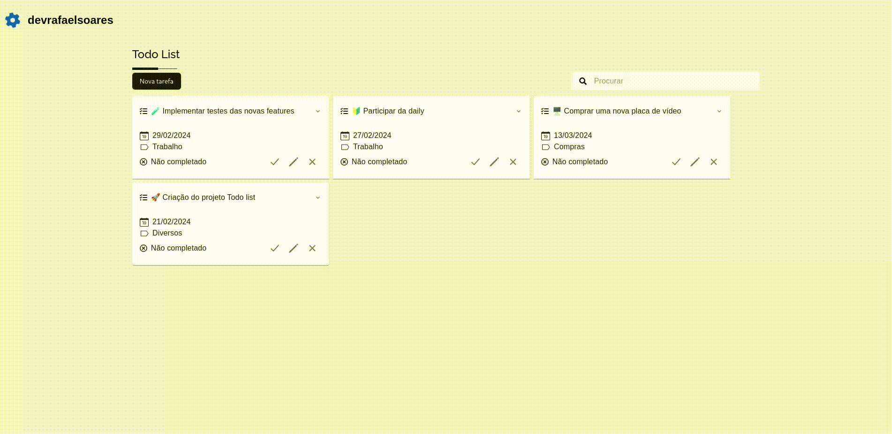
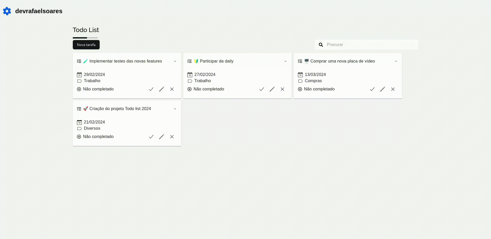
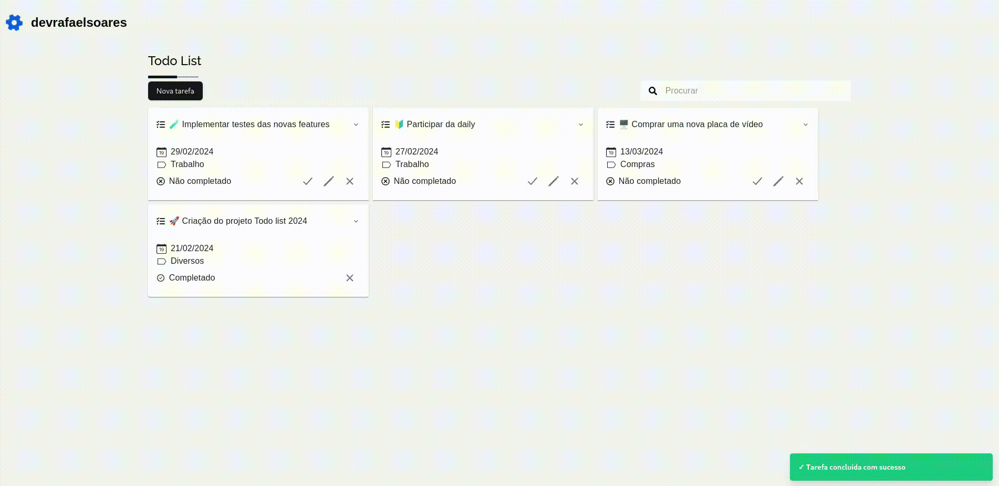

# 📑 Todo list App

[![Contributors][contributors-shield]][contributors-url] [![Forks][forks-shield]][forks-url] [![Stargazers][stars-shield]][stars-url] [![Issues][issues-shield]][issues-url] [![MIT License][license-shield]][license-url]

### 📑 Tópicos:

-   [Sobre](#sobre)
-   [Instalação](#instalação)
-   [Como usar?](#como-usar)
-   [Contatos](#contatos)

## Sobre

### Aplicação Web que realizar o gerenciamentos de tarefas. Permitindo a criação, edição e conclusão de suas tarefas.

## Instalação

#### ⚠️ Será necessário ter instalado em seu sistema operacional o Docker

#### Dentro da pasta do projeto execute os seguintes comandos:

#### 📌 Criando a imagem do projeto:

```docker
docker build . -t todo-list-app
```

#### 📌 Criando e executando o contâiner da imagem expondo na porta 5173

```docker
docker container run -d -p 5173:5173 todo-list-app
```

#### ⚠️ Verifique antes se existe algum processo esteje rodando em background na porta especificada para uso do contâiner, caso tenha encerre este processo

## Como usar ?

### 📍 Acesse http://localhost:5173

### ➕ Criação de uma nova tarefa

<div align="center">
    
</div>

### ✏️ Edição de uma tarefa

<div align="center">
    
</div>

### ✅ COmpletar uma tarefa

<div align="center">
    
</div>

### ❌ Deletar uma tarefa

<div align="center">
    
</div>

## Contatos

[![LinkedIn][linkedin-shield]][linkedin-url] [![Gmail][gmail-shield]][gmail-url] [![Meu Portfolio][me-portfolio-shield]][me-portfolio-url]

[contributors-shield]: https://img.shields.io/github/contributors/devrafaelsoares/todo-list.svg?style=for-the-badge
[contributors-url]: https://github.com/devrafaelsoares/todo-list/graphs/contributors
[forks-shield]: https://img.shields.io/github/forks/devrafaelsoares/todo-list.svg?style=for-the-badge
[forks-url]: https://github.com/devrafaelsoares/todo-list/network/members
[stars-shield]: https://img.shields.io/github/stars/github-profiles-app/react-countdown.svg?style=for-the-badge
[stars-url]: https://github.com/devrafaelsoares/todo-list/stargazers
[issues-shield]: https://img.shields.io/github/issues/devrafaelsoares/todo-list.svg?style=for-the-badge
[issues-url]: https://github.com/devrafaelsoares/todo-list/issues
[license-shield]: https://img.shields.io/github/license/devrafaelsoares/todo-list.svg?style=for-the-badge
[license-url]: https://github.com/devrafaelsoares/todo-list/blob/master/LICENSE
[license-url]: https://github.com/devrafaelsoares/store-api-restful/blob/master/LICENSE
[linkedin-shield]: https://img.shields.io/badge/LinkedIn-0077B5?style=for-the-badge&logo=linkedin&logoColor=white
[linkedin-url]: https://www.linkedin.com/in/rafael-henrique-soares-de-freitas-2a667a23a/
[gmail-shield]: https://img.shields.io/badge/Gmail-D14836?style=for-the-badge&logo=gmail&logoColor=white
[gmail-url]: mailto:rafael.soares.developer@gmail.com
[me-portfolio-shield]: https://img.shields.io/badge/website-000000?style=for-the-badge&logo=About.me&logoColor=white
[me-portfolio-url]: https://devrafaelsoares.vercel.app
